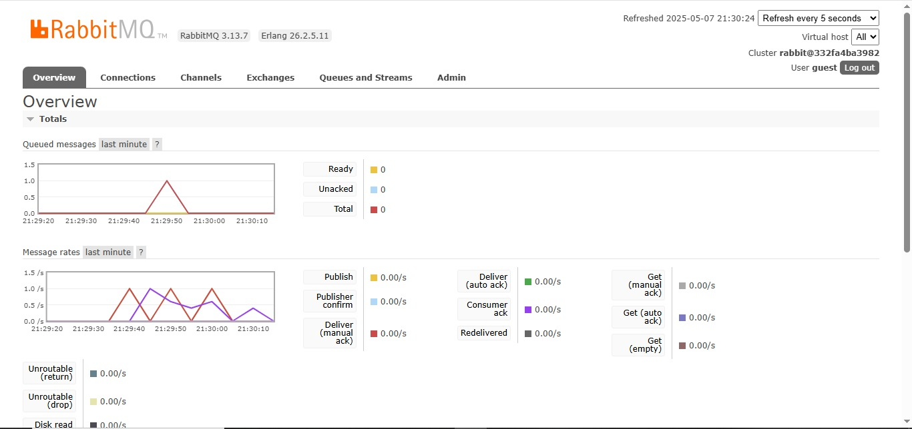
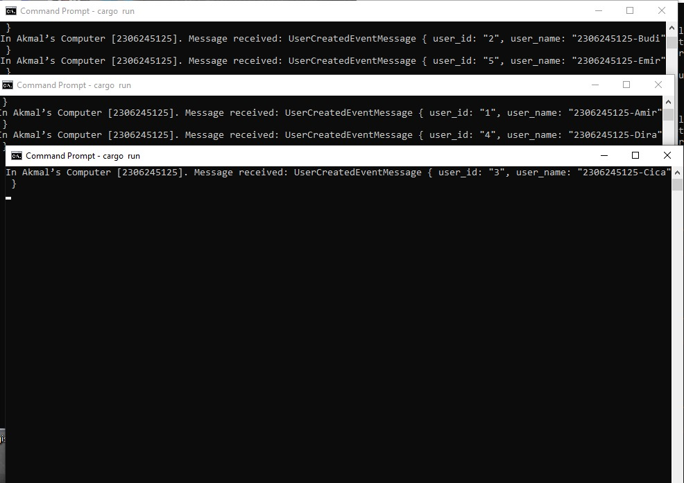
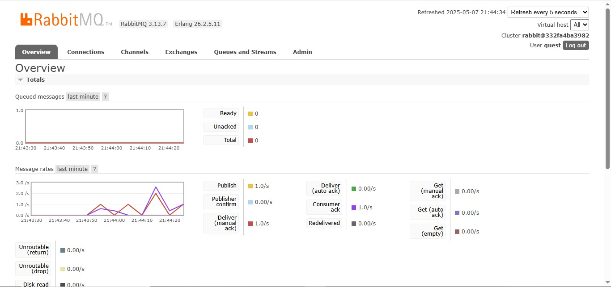

## AdvProg - Tutorial Module 09
<h2>
Nama   : Muhammad Akmal Abdul Halim

Kelas  : B

NPM    : 2306245125
</h2>

**a. What is amqp?**

AMQP (Advanced Message Queuing Protocol) adalah protokol standar terbuka pada lapisan aplikasi yang digunakan untuk middleware berorientasi pesan. Protokol ini memungkinkan aplikasi untuk berkomunikasi satu sama lain dengan mengirimkan pesan antar aplikasi, terlepas dari platform atau bahasa pemrograman yang digunakan untuk membangunnya. AMQP menyediakan fitur-fitur penting seperti pengiriman pesan yang andal, antrian pesan yang dapat disimpan hingga aplikasi penerima siap memprosesnya, kemampuan routing untuk mengarahkan pesan ke aplikasi penerima berdasarkan aturan tertentu, dukungan untuk transaksi dan konfirmasi, serta fitur keamanan seperti otentikasi dan enkripsi. Protokol ini banyak digunakan dalam sistem pesan enterprise dan broker pesan seperti RabbitMQ, Apache ActiveMQ, dan Azure Service Bus, menjadikannya pilihan populer untuk membangun sistem terdistribusi yang handal dan dapat diskalakan.

**b. What does it mean? guest:guest@localhost:5672 , what is the first guest, and what
is the second guest, and what is localhost:5672 is for?**

String "guest:guest@localhost:5672" adalah format URL koneksi yang digunakan untuk terhubung ke broker AMQP seperti RabbitMQ. Pada format ini, "guest" pertama merupakan username yang digunakan untuk autentikasi ke server AMQP. Sedangkan "guest" kedua adalah password yang digunakan untuk autentikasi tersebut. "guest:guest" umumnya merupakan kredensial default yang disediakan oleh broker AMQP seperti RabbitMQ untuk koneksi lokal. Bagian "localhost" menunjukkan alamat host atau server tempat broker AMQP berjalan, dalam kasus ini merujuk ke komputer lokal pengguna sendiri. Sementara angka "5672" adalah nomor port yang digunakan oleh broker AMQP untuk menerima koneksi dari klien. Port 5672 merupakan port standar yang digunakan oleh protokol AMQP untuk komunikasi tanpa enkripsi.

## Simulation slow subscriber

Berdasarkan grafik RabbitMQ yang ditampilkan, terlihat lonjakan sekitar 1.0 pesan dalam antrian pada titik waktu tertentu. Fenomena ini terjadi karena kita mengimplementasikan pola "slow subscriber" dalam kode main.rs. Dalam implementasi tersebut, consumer sengaja dibuat lambat dengan menambahkan delay selama 1 detik untuk setiap pemrosesan pesan (thread::sleep(ten_millis) dengan ten_millis diatur ke 1000 ms). Ketika pesan dipublikasikan dengan kecepatan lebih tinggi daripada kemampuan consumer untuk memprosesnya, pesan-pesan tersebut menumpuk sementara dalam antrian, yang merupakan salah satu fungsi utama dari message broker seperti RabbitMQ. Grafik tersebut dengan jelas menggambarkan ketidakseimbangan antara laju pengiriman pesan oleh publisher dan kecepatan pemrosesan oleh subscriber, yang memang sengaja dibuat sebagai bagian dari simulasi "slow subscriber" . Setelah publisher berhenti mengirim pesan, subscriber akhirnya dapat mengejar ketinggalan dan memproses semua pesan dalam antrian, yang ditunjukkan oleh nilai 0 pada semua metrik saat ini.

## Reflection and Running at least three subscribers

Dari gambar diatas terlihat bahwa ketika kita menjalankan 3 instance secara bersamaan dan menjalankan cargo run untuk publisher, hasilnya adalah masing masing instance menerima pesan yang berbeda. Fenomena ini terjadi karena RabbitMQ mengimplementasikan pola "competing consumers" (konsumen bersaing), di mana ketika beberapa consumer terhubung ke antrian yang sama, RabbitMQ akan mendistribusikan pesan di antara mereka secara round-robin. Ini berarti setiap pesan hanya dikirim ke satu consumer, bukan ke semua consumer.

Pola ini sebenarnya adalah fitur bukan bug, karena memungkinkan pemrosesan paralel dan load balancing. Dalam kasus simulasi "slow subscriber" yang kita implementasikan dalam main.rs, menjalankan beberapa consumer secara bersamaan dapat meningkatkan throughput secara keseluruhan. Ini karena delay 1 detik yang kita terapkan pada setiap consumer tidak lagi menjadi bottleneck tunggal, melainkan terdistribusi di antara semua instance.

Yang dapat ditingkatkan dari implementasi ini adalah:

1. Jika kita ingin setiap subscriber menerima semua pesan (pola publish-subscribe), kita perlu menggunakan exchange tipe "fanout" atau "topic" dan membuat antrian terpisah untuk setiap consumer.

2. Implementasi penanganan error yang lebih baik pada subscriber untuk menangani kasus ketika RabbitMQ tidak tersedia atau koneksi terputus.

3. Mekanisme penyimpanan pesan untuk kasus dimana semua subscriber sedang offline atau tidak dapat memproses pesan.

Distribusi pesan yang ditampilkan dalam gambar juga menunjukkan bagaimana RabbitMQ secara efektif dapat meningkatkan throughput sistem dengan metode penskalaan horizontal (menambah jumlah consumer) untuk menangani beban besar.